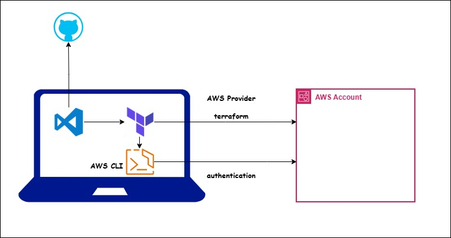

# Terraform


### Terraform

We need to understand what are the advantages and problems terraform is solving. It is popular infrastructure as a tool (IaC) tool as of now. Advantages of IaC are

* **Version Control:** <br />
    Since it is code, we can maintain in GIT to version control it. We can maintain complete history of development. Collaboration is easy.
 
* **Consistent Infrastructure:** <br />
    Often we face the problem diff configurations in different environments like DEV, QA, PROD, etc. Using terraform we can create the infrastructure in multiple environments with more reliability.

* **Automated Infra CRUD:** <br />
    Using terraform we can create entire infra in minutes reducing the human errors while creating manually.
    Using terraform we can update the infra easily.
    Using terraform we can delete the infra easily.

* **Inventory Management:** <br />
    If we create infra manually it is very tough to maintain the inventory of services. But by seeing the terraform resources anyone can know the services being used for project.

* **Cost Optimisation:** <br />
    When we need infra we can create in minutes. When we don't need we can destroy in minutes. Saving cost and time.

* **Automatic dependency management:** <br />
    Terraform can understand the dependency between resources while creating, updating and deleting.

* **Modular Infra:** <br />
    We can develop our own modules or use open source modules to reuse the infra code. Any one can reuse our code and create infra instead of spending more time on their own.
<<<<<<< HEAD
=======


# 🚀 Terraform Infrastructure Automation Project

## 📌 Overview

This repository contains **Infrastructure as Code (IaC)** built using Terraform to provision and manage cloud infrastructure in an automated, repeatable, and scalable way.

This project demonstrates real-world DevOps practices including:

* Infrastructure as Code (IaC)
* Modular Terraform structure
* Remote backend configuration
* State management
* Secure provider authentication
* Version control best practices
* Production-ready structure

---

## 🛠 Tech Stack

* Terraform
* AWS (or any cloud provider)
* Git & GitHub
* Remote Backend (S3 + DynamoDB recommended)

---

## 📂 Project Structure

```
Terraform/
│
├── main.tf              # Main infrastructure resources
├── provider.tf          # Provider configuration
├── variables.tf         # Input variables
├── outputs.tf           # Output values
├── terraform.tfvars     # Variable values (not committed in production)
├── .gitignore           # Ignored files
└── README.md            # Project documentation
```

---

## ⚙️ Prerequisites

Before running this project, ensure you have:

* Terraform installed (`terraform -v`)
* AWS CLI configured (`aws configure`)
* IAM user with required permissions
* Git installed

---

## 🔐 Authentication Setup

Terraform authenticates using:

### Option 1: AWS CLI

Configured via:

```
aws configure
```

### Option 2: Environment Variables

```
export AWS_ACCESS_KEY_ID="your_access_key"
export AWS_SECRET_ACCESS_KEY="your_secret_key"
```

⚠️ **Never commit secrets to GitHub**

---

## 🚀 How to Use This Project

### 1️⃣ Initialize Terraform

```
terraform init
```

Downloads required providers and initializes backend.

---

### 2️⃣ Validate Configuration

```
terraform validate
```

Checks syntax and configuration correctness.

---

### 3️⃣ Format Code (Best Practice)

```
terraform fmt
```

Ensures consistent formatting.

---

### 4️⃣ Plan Infrastructure

```
terraform plan
```

Shows what resources will be created/modified/destroyed.

---

### 5️⃣ Apply Infrastructure

```
terraform apply
```

Auto approve:

```
terraform apply -auto-approve
```

---

### 6️⃣ Destroy Infrastructure

```
terraform destroy
```

Removes all managed resources.

---

## 📦 State Management

Terraform state files:

* `terraform.tfstate`
* `terraform.tfstate.backup`

These files:

* Store infrastructure metadata
* Map real resources to Terraform config
* **Should NEVER be committed**

---

## ✅ Best Practice: Remote Backend

Use:

* **AWS S3** → State storage
* **DynamoDB** → State locking

### Example:

```
terraform {
  backend "s3" {
    bucket         = "my-terraform-state-bucket"
    key            = "terraform/terraform.tfstate"
    region         = "ap-south-1"
    dynamodb_table = "terraform-lock-table"
    encrypt        = true
  }
}
```

---

## 🔄 Versioning

```
terraform {
  required_version = ">= 1.0.0"

  required_providers {
    aws = {
      source  = "hashicorp/aws"
      version = "~> 6.0"
    }
  }
}
```

---

## 🧠 Best Practices Followed

* Modular structure
* Variables instead of hardcoding
* Proper outputs
* Sensitive values not committed
* `.gitignore` configured
* Clean Git history
* Infrastructure reproducibility
* Remote state usage

---

## 📊 Commands Cheat Sheet

| Command            | Description        |
| ------------------ | ------------------ |
| terraform init     | Initialize project |
| terraform validate | Validate config    |
| terraform fmt      | Format code        |
| terraform plan     | Preview changes    |
| terraform apply    | Apply changes      |
| terraform destroy  | Destroy infra      |
| terraform show     | Show current state |

---

## 🔍 Troubleshooting

### ❌ Non-fast-forward Git error

```
git pull --rebase
```

### ❌ State Lock Error

* Check DynamoDB lock table
* Remove stale lock if necessary

---

## 📈 Future Improvements

* Convert into reusable modules
* Implement CI/CD using GitHub Actions
* Add environment-based folders (dev/stage/prod)
* Integrate with Kubernetes / EKS
* Add automated testing

---

## 👨‍💻 Author

**Bhanu Prakash Yalavarthi**
DevOps Engineer

---

⭐ *If you found this project useful, consider giving it a star!*
>>>>>>> 5420459 (readme)
